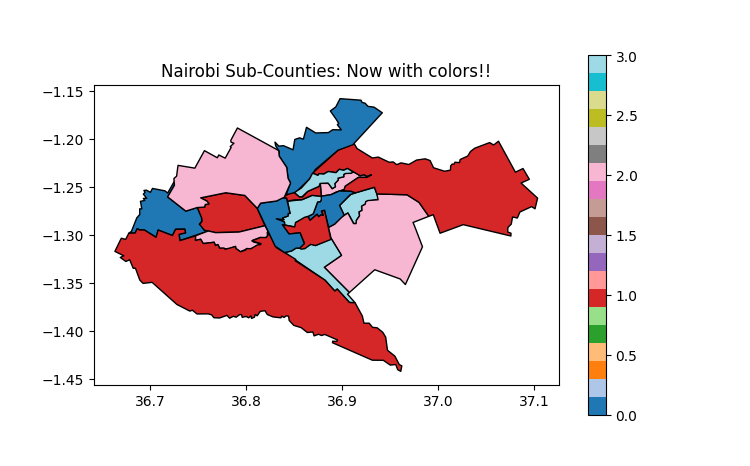

Nairobi Sub-Counties 'greedyly' colouring.
-----------------------------------------

## Overview
This project analyzes Nairobi sub-counties using geographical data from GADM (https://gadm.org/download_country.html).  The analysis includes exploratory data visualization and graph coloring to assign distinct colors to adjacent sub-counties.

## Imported Libraries
The following libraries are used across the notebook files:
- `geopandas` (imported as `gpd`): For handling geospatial data and GeoJSON files.
- `networkx` (imported as `nx`): For graph creation and coloring algorithms.
- `matplotlib.pyplot` (imported as `plt`): For plotting and visualization.

- `pip install geopandas networkx matplotlib ipykernel`is the command to install the main libraies, the rest as in `requirements.txt` are dependancies.
- Note that 'ipykernel' is for running of the jupyter notebooks.

## Notebook Summaries

### eda1.ipynb: Nairobi Sub-Counties Polygon Plot
This notebook performs initial exploratory data analysis on the Nairobi sub-counties dataset.

1. **Data Loading**: Reads the Kenya administrative boundaries from `data/gadm41_KEN_2.json` using GeoPandas.
2. **Data Inspection**: Displays the first few rows of the dataset and checks the total number of records.
3. **Filtering**: Extracts only the records for Nairobi county (NAME_1 == "Nairobi").
4. **Basic Plotting**: Creates a simple polygon plot of Nairobi sub-counties with black edges.
5. **Labeled Plotting**: Enhances the plot by adding text labels for each sub-county name at their centroids.

### idk.ipynb: Graph Coloring for Sub-Counties
This notebook implements graph coloring to solve the problem of assigning colors to Nairobi sub-counties such that no two adjacent sub-counties share the same color. This is useful in advanced map visualization and thematic mapping.

1. **Data Loading and Preparation**: Loads the Kenya GeoJSON data, filters for Nairobi, and resets the index.
2. **Neighbor Detection**: Identifies neighboring sub-counties by checking geometric intersections between polygons.
3. **Graph Construction**: Creates an undirected graph using NetworkX where each sub-county is a node, and edges connect neighboring sub-counties.
4. **Graph Coloring**: Applies the greedy coloring algorithm with the DSATUR strategy to assign colors to nodes.
5. **Color Mapping**: Maps the numerical color indices to a predefined color palette (green, blue, orange, pink).
6. **Colored Visualization**: Plots the Nairobi sub-counties map with each sub-county colored according to the graph coloring result, using a categorical colormap and black edges for boundaries.

## Script Implementation: The main file (`idk.py`)

The code from the `code/idk.ipynb` notebook was carefully incorporated into the standalone Python script `code/idk.py`. Key adaptations include:

- Combining all code cells into a single executable script.
- Adding detailed comments for clarity and maintainability.
- Removing interactive elements (like uncommented plot shows) and ensuring the script runs end-to-end.
- Preserving the core logic: data loading, neighbor detection, graph construction, coloring, and visualization.

The script can be run with `python idk.py` from the project(or this file) root.

## Output to be expected

When running `idk.py`, the following outputs are generated:

- **Console Output**: Prints the list of Nairobi sub-county names to the console with new indexes.
- **Visualization**: Displays an interactive matplotlib plot window showing the colored Nairobi sub-counties map. The plot includes a legend titled "Nairobi Sub-Counties: Now with colors!!".

Note: The plot is displayed in a GUI window and does not save to a file by default. To save the plot, you can modify the script to include `plt.savefig('output/output.png')` before `plt.show()`.

Author📔: Anthony Mndenyi
------------------------
